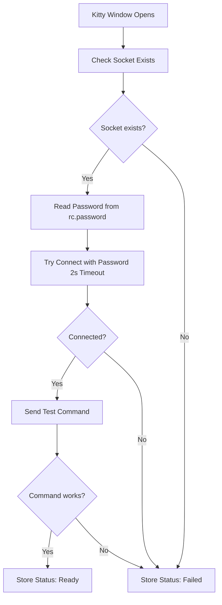
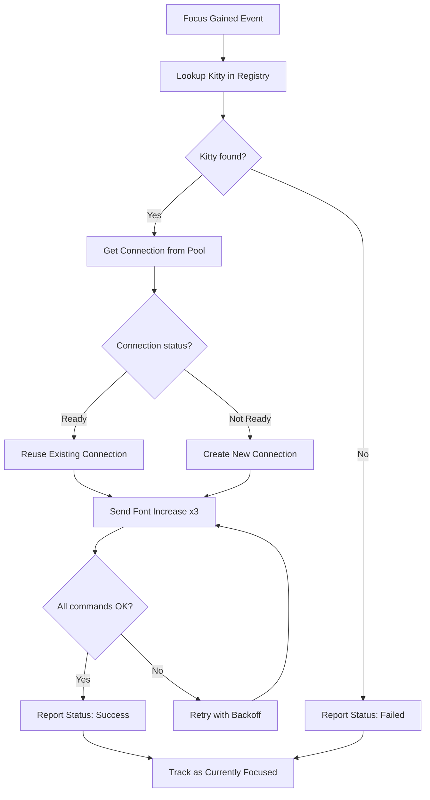
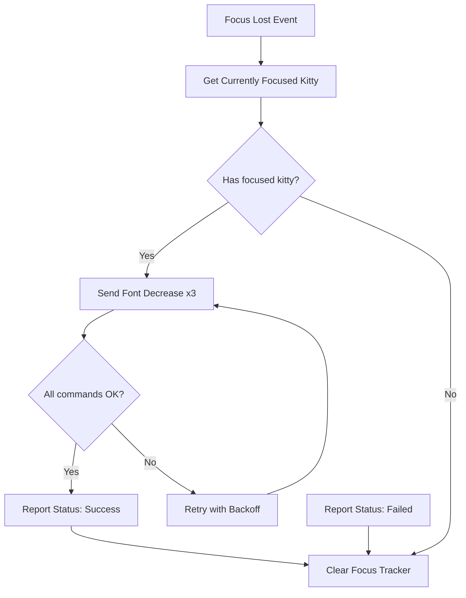

# Plan: Kitty Registry Connection Pool

## Problem Statement

The current `kitty-focus-tracker` implementation has several limitations that affect reliability and user experience:

1. **No connection pooling** - Every time we adjust font size, we create a new connection, send the command, and close it. This is inefficient and adds unnecessary latency.

2. **No retry logic** - If a connection fails transiently, the operation fails immediately with no recovery mechanism.

3. **No status tracking** - We repeatedly attempt to connect to kitty instances that can't be controlled, wasting resources and creating noise.

4. **Incorrect focus lost behavior** - When focus is lost, we iterate through ALL kitty windows to decrease font size. This is wrong - we should only affect the kitty that just lost focus.

## Design Goals

1. **Reliability** - Retry transient failures automatically
2. **Performance** - Reuse connections when possible
3. **Correctness** - Only affect the kitty that actually gained/lost focus
4. **Visibility** - Track which kitty instances are controllable
5. **Resource management** - Clean up unused connections

## Proposed Solution

### Connection Registry

Create a central registry that manages all kitty remote control connections:

- **Track connections** by kitty PID
- **Maintain status** for each kitty (ready, failed, no remote control)
- **Pool connections** for reuse instead of creating new ones each time
- **Retry failed operations** with exponential backoff
- **Authenticate** using password from `~/.config/kitty/rc.password`
- **Connect** to sockets at `unix:${XDG_RUNTIME_DIR}/kitty/kitty-{kitty_pid}.sock`

### How It Works

#### Initialization

When a kitty window opens, the registry:

1. Checks if remote control socket exists at `unix:${XDG_RUNTIME_DIR}/kitty/kitty-{kitty_pid}.sock`
2. Reads password from `~/.config/kitty/rc.password` (generated by `enable-rc.sh`)
3. Attempts to connect with password authentication and short timeout (2 seconds)
4. If connection succeeds and works, marks as "ready"
5. If connection fails, marks status and reason

This happens in the background without blocking the niri event loop.

**Connection Rendezvous:**
- Socket path: `unix:${XDG_RUNTIME_DIR}/kitty/kitty-{kitty_pid}.sock` (set by `enable-rc.sh`)
- Password: Read from `~/.config/kitty/rc.password` (generated by `enable-rc.sh` with `pwgen -s 48 1`)
- Auth mode: `allow_remote_control password` (configured by `enable-rc.sh`)

#### Focus Events

**When a kitty gains focus:**
1. Look up the kitty's PID in the registry
2. Get or create a connection (reuse if available)
3. Send font size increase commands (3x)
4. If connection fails, retry with backoff
5. Report structured status in JSON output
6. Track that this kitty currently has focus

**When a kitty loses focus:**
1. Look up which kitty currently has focus
2. Send font size decrease commands (3x) to THAT kitty only
3. Report structured status in JSON output
4. Clear the current focus tracker

#### Connection Pool Management

- **Reuse** existing connections when possible
- **Remove** connections that fail or time out
- **Cleanup** idle connections after 5 minutes of inactivity
- **Limit** maximum number of open connections (default: 10)

#### Retry Logic

When a command fails:

1. **Attempt 1**: Immediate retry
2. **Attempt 2**: Wait 100ms, retry
3. **Attempt 3**: Wait 200ms, retry
4. **Give up**: Report failure and mark connection as failed

If a connection repeatedly fails, we stop trying to reconnect until the kitty restarts.

### Status Tracking

For each kitty PID, track:

- **Remote control capability**: Does a socket exist?
- **Connection status**: Can we connect and send commands?
- **Last activity**: When was this connection last used?
- **Error history**: What errors occurred (if any)?

This information is used to:
- Avoid repeated failed connection attempts
- Provide better error messages
- Clean up stale connections

### Configuration

User-configurable options:

- `--socket-timeout SECS` - Connection timeout (default: 2)
- `--max-retries N` - Maximum retry attempts (default: 3)
- `--max-connections N` - Maximum pooled connections (default: 10)
- `--idle-timeout SECS` - Cleanup idle connections (default: 1800, 30 minutes)
- `--reap-interval SECS` - Timer interval for reaping old sessions (default: 300, 5 minutes)

## Event Flow

### Initialization Flow

### Focus Gained Flow

### Focus Lost Flow

## Error Handling

### Connection Errors

- **Socket not found**: Kitty wasn't started with remote control enabled
  - Status: `not_configured`
  - Log warning, don't retry

- **Password file missing**: `~/.config/kitty/rc.password` doesn't exist
  - Status: `not_configured`
  - Suggest running `enable-rc.sh` to set up remote control
  - Don't retry

- **Connection timeout**: Kitty busy or slow to respond
  - Retry with exponential backoff
  - After max retries, mark as `failed`

- **Command failed**: Kitty rejected the command
  - Retry the specific command
  - After max retries, mark as `failed`

### Recovery

- **Transient failure**: Retry automatically
- **Permanent failure**: Mark status, stop retrying until kitty restarts
- **Kitty restart**: Detected on next window open event, reset status

## Resource Management

### Idle Connections

A background timer runs every 5 minutes (configurable via `--reap-interval`) that:
1. Iterates through all pooled connections
2. Identifies connections idle longer than the idle timeout (default: 30 minutes)
3. Closes idle connections gracefully
4. Removes them from the pool
5. Clears their status

This prevents resource leaks from old kitty instances.

### Shutdown

On program exit:
1. Close all open connections
2. Clear all status tracking
3. Flush any pending operations

## Testing Scenarios

1. **Connection reuse**
   - Focus kitty A twice in a row
   - Second focus should reuse existing connection
   - Verify latency is lower than first focus

2. **Retry on failure**
   - Temporarily disconnect kitty socket
   - Focus kitty and verify retry attempts
   - Verify backoff timing (0ms, 100ms, 200ms)

3. **Focus tracking**
   - Launch kitty A and kitty B
   - Focus A, then B
   - Lose focus from B
   - Verify only B's font size decreases

4. **Mixed configurations**
   - Launch 3 kitties (only 1 with remote control)
   - Focus each
   - Verify correct status reporting (success for configured, not_configured for others)

5. **Idle cleanup**
   - Launch kitty, focus it once
   - Wait 6 minutes
   - Verify connection cleaned up

## Open Questions

1. **Proactive vs Lazy checks**
   - Lazy (on first use): Simpler, slower first operation
   - Proactive (background): Better UX, catches failures early
   - **Recommendation**: Lazy with cached results

2. **Health check frequency**
   - Too frequent wastes resources
   - Too infrequent leads to stale connections
   - **Recommendation**: Check on demand, cache results

3. **Should we auto-configure remote control?**
   - Would modify running processes
   - Security concern
   - **Recommendation**: No, provide clear setup instructions instead

## Success Criteria

- [x] Connection pooling reduces latency on repeated operations
- [x] Retry logic handles transient failures gracefully
- [x] Focus lost only affects the kitty that lost focus
- [x] Status tracking prevents repeated failed attempts
- [x] Idle connections are cleaned up
- [x] Graceful shutdown on program exit
- [x] Clear error messages with structured status
- [x] Works with mixed kitty configurations
